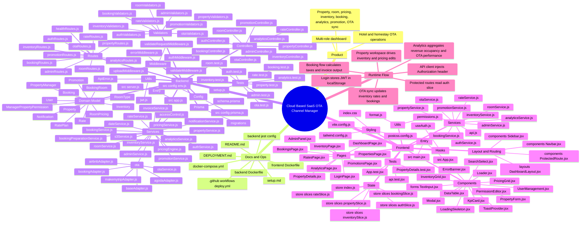

# Repo Mind Map

```mermaid
mindmap
  root((Cloud Based SaaS OTA Channel Manager))
    Product
      Hotel and homestay OTA operations
      Multi-role dashboard
      Property, room, pricing, inventory, booking, analytics, promotion, OTA sync
    Docs and Ops
      README.md
      setup.md
      DEPLOYMENT.md
      docker-compose.yml
      .github workflows deploy.yml
      backend Dockerfile
      frontend Dockerfile
      backend jest config
    Backend
      Entry
        src server.js
        src app.js
      Config
        src config env.js
        src config prisma.js
      Middleware
        authMiddleware.js
        errorMiddleware.js
        validateMiddleware.js
        validateRequestMiddleware.js
        uploadMiddleware.js
      Utils
        ApiError.js
        jwt.js
      Validators
        authValidators.js
        adminValidators.js
        propertyValidators.js
        roomValidators.js
        inventoryValidators.js
        rateValidators.js
        otaValidators.js
        bookingValidators.js
        promotionValidators.js
      Routes
        healthRoutes.js
        authRoutes.js
        adminRoutes.js
        propertyRoutes.js
        roomRoutes.js
        inventoryRoutes.js
        rateRoutes.js
        otaRoutes.js
        bookingRoutes.js
        analyticsRoutes.js
        promotionRoutes.js
      Controllers
        authController.js
        adminController.js
        propertyController.js
        roomController.js
        inventoryController.js
        rateController.js
        otaController.js
        bookingController.js
        analyticsController.js
        promotionController.js
      Services
        authService.js
        accessControl.js
        adminService.js
        propertyService.js
        roomService.js
        inventoryService.js
        rateService.js
        pricingService.js
        pricingEngine.js
        bookingService.js
        bookingPreparationService.js
        invoiceService.js
        notificationService.js
        analyticsService.js
        promotionService.js
        s3Service.js
        dateService.js
        ota
          otaService.js
          baseAdapter.js
          bookingAdapter.js
          airbnbAdapter.js
          agodaAdapter.js
          makemytripAdapter.js
      Domain Model
        User
        Property
        PropertyManager
        ManagerPropertyPermission
        RoomType
        Inventory
        Rate
        RatePlan
        RoomPricing
        Booking
        BookingRoom
        Notification
        Promotion
      Prisma
        schema.prisma
        migrations
      Tests
        auth.test.js
        property.test.js
        room.test.js
        inventory.test.js
        rate.test.js
        ota.test.js
        booking.test.js
        analytics.test.js
        admin.test.js
        setup.js
    Frontend
      Entry
        src main.jsx
        src App.jsx
      Layout and Routing
        layouts DashboardLayout.jsx
        components ProtectedRoute.jsx
        components Sidebar.jsx
        components Navbar.jsx
      State
        store index.js
        store slices authSlice.js
        store slices propertySlice.js
        store slices inventorySlice.js
        store slices rateSlice.js
        store slices bookingSlice.js
      Services
        api.js
        authService.js
        propertyService.js
        roomService.js
        inventoryService.js
        rateService.js
        bookingService.js
        analyticsService.js
        promotionService.js
        otaService.js
        adminService.js
      Hooks
        useAuth.js
      Utils
        permissions.js
        format.js
      Pages
        LoginPage.jsx
        DashboardPage.jsx
        PropertiesPage.jsx
        PropertyDetails.jsx
        InventoryPage.jsx
        RatesPage.jsx
        BookingsPage.jsx
        PromotionsPage.jsx
        AnalyticsPage.jsx
        AdminPanel.jsx
      Components
        ToastProvider.jsx
        Modal.jsx
        LoadingSkeleton.jsx
        Loader.jsx
        ErrorBanner.jsx
        DataTable.jsx
        SearchSelect.jsx
        PropertyForm.jsx
        InventoryGrid.jsx
        PricingGrid.jsx
        UserManagement.jsx
        PermissionEditor.jsx
        KpiCard.jsx
        forms TextInput.jsx
      Styling
        index.css
        tailwind.config.js
        postcss.config.js
        vite.config.js
      Tests
        App.test.jsx
        api.test.jsx
        PropertyDetails.test.jsx
    Runtime Flow
      Login stores JWT in localStorage
      Protected routes read auth slice
      API client injects Authorization header
      Property workspace drives inventory and pricing edits
      Booking flow calculates taxes and invoice output
      Analytics aggregates revenue occupancy and OTA performance
      OTA sync updates inventory rates and bookings
```
